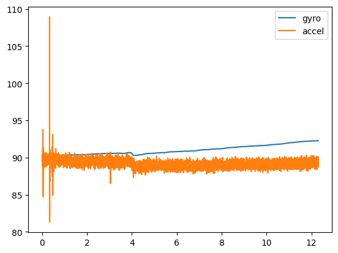
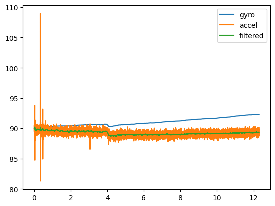

# Design Journal

## 2024-1-7
I've been working with my Sparkfun IMU with great success! I did some reading on SPI and I2C, then I plugged my IMU into my Arduino and everything worked! Right now, I can get my computer to display the accelerometer, gyroscope, magnetometer and thermometer readings through a serial port.

Thinking about how to measure where a point is in space, and I'm thinking about combining the magnetometer and the accelerometer. The benefit of the magnetometer is that if I had a magnet in the middle of my hand, I could (at least in theory) always accurately determine where my finger was relative to the hand. This does face the minor problem of interference from other magnets, which means I'll need to use the accelerometer as well.

I'm  happy with how this is going so far! Until next time.

## 2024-1-28
I worked on some other stuff, but now that I'm mostly done with my Waland tomfoolery I can get back to work on this :) I looked at the Digital Motion Processor on my IMU and it seemed pretty cool, my only problem is that the controller takes up more space than my Arduino can handle lol. I'm going to need a better arduino, hopefully I can also start running it on my main Linux PC instead of my old Mac laptop. There's lots of stuff I'm still thinking about, but I'm pretty much ready to fully get started on this project. Should be fun :D

## 2024-2-19
I've messed around a bit more, and I finally ordered an Arduino Uno R4 Minima, which was plenty of storage :D. I'm excited to keep working on this.

## 2024-2-22
I GOT THE NEW ARDUINO! It has tons of space and I got to mess around with the DMP some more. I'm experiencing a weird issue that I don't really understand where the accelerometer is displaying VERY high values for no apparent reason. Hopefully I can figure this out.

## 2024-2-26
I've been messing with the arduino, and I made some firmware to send accelerometer and gyroscope data to my computer. Now, I'm trying to figure out how to tune the gyroscope values to make sense (right now they drift like craaaaaazyyyyy).

## 2024-3-6
I'm still messing around with stopping drift, right now I'm experimenting with using a kalman filter. It uses accelerometer data to support gyroscope data. LOOK:

Gyro drifts like crazy, but accelerometer data stays constant. If I can combine them, I should get a pretty good reading.

After combining them, the green line shows the final reading (no fancy kalman filters here). Pretty good!

## 2024-3-15
I've been doing a lot more work, but unfortunately my IMU has broken :(. I have ordered several more IMUs, but they wont arrive for around a month. I'm going to work on other projects in the meantime, but I'm excited to keep working on this!

# 2024-4-26
I'd like to give a little update on what I've been working on. My new IMUs arrived, but they didn't work properly. So, I've decided to change my approach to this project, instead using hand recognition from cameras to recognize hand gestures.
